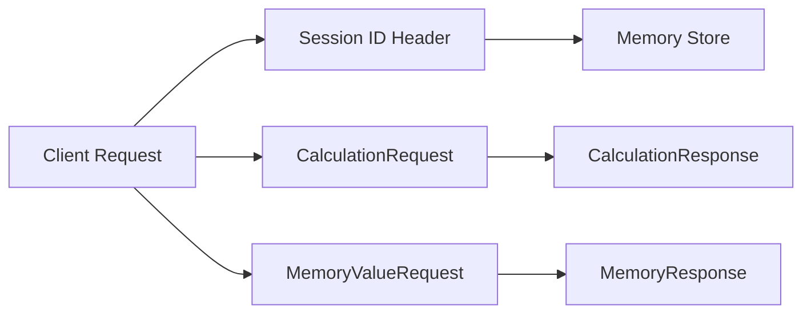

# Data Model: Calculator Backend API

## Request Models

### CalculationRequest

| Field | Type | Required | Validation | Description |
|-------|------|----------|------------|-------------|
| operand1 | float | Yes | - | First operand |
| operand2 | float | Yes | - | Second operand |
| operator | str | Yes | `+`, `-`, `*`, `/` | Arithmetic operator |

```python
class CalculationRequest(BaseModel):
    operand1: float
    operand2: float
    operator: Literal["+", "-", "*", "/"]
```

### MemoryValueRequest

| Field | Type | Required | Validation | Description |
|-------|------|----------|------------|-------------|
| value | float | Yes | - | Value to add/subtract |

```python
class MemoryValueRequest(BaseModel):
    value: float
```

## Response Models

### CalculationResponse

| Field | Type | Description |
|-------|------|-------------|
| result | float | Calculation result |
| operation | str | Human-readable operation (e.g., "10.5 + 5.0") |

```python
class CalculationResponse(BaseModel):
    result: float
    operation: str
```

### MemoryResponse

| Field | Type | Optional | Description |
|-------|------|----------|-------------|
| memory | float | No | Current memory value |
| operation | str | Yes | Operation performed (e.g., "M+ 10.0") |

```python
class MemoryResponse(BaseModel):
    memory: float
    operation: str | None = None
```

### ErrorResponse

| Field | Type | Description |
|-------|------|-------------|
| error | str | Human-readable error message |
| code | str | Machine-readable error code |

```python
class ErrorResponse(BaseModel):
    error: str
    code: str
```

## Session Storage

### Memory Store

In-memory dictionary storing session memory values.

| Key | Value Type | Default |
|-----|------------|---------|
| session_id (UUID str) | float | 0.0 |

```python
# Global session store
_memory_store: dict[str, float] = {}

def get_memory(session_id: str) -> float:
    return _memory_store.get(session_id, 0.0)

def set_memory(session_id: str, value: float) -> None:
    _memory_store[session_id] = value
```

## Entity Relationships



## Validation Rules

| Rule | Applies To | Behavior |
|------|------------|----------|
| Division by zero | CalculationRequest | Reject if operator="/" and operand2=0 |
| Invalid operator | CalculationRequest | Reject if operator not in [+,-,*,/] |
| Missing fields | All requests | Return 422 validation error |
| Invalid types | All requests | Return 422 validation error |

