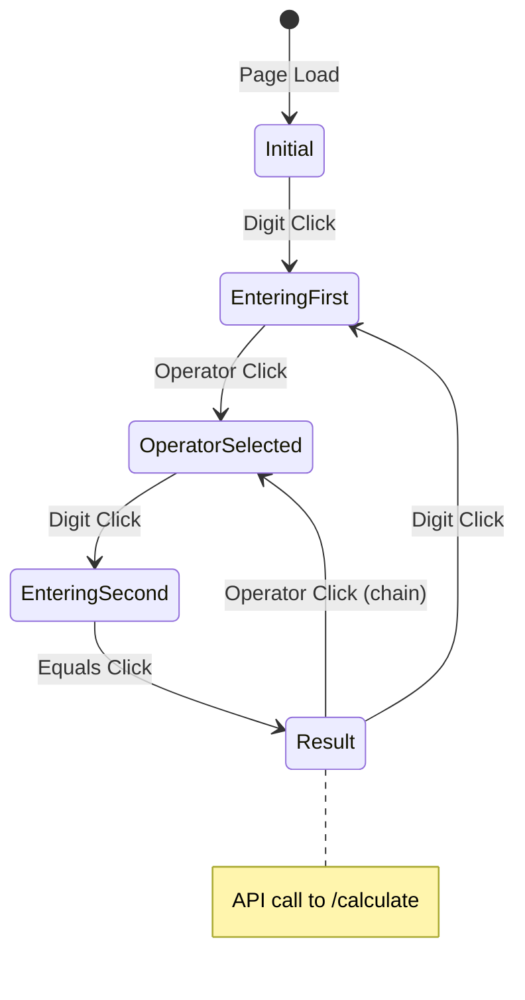

# Data Model: Calculator Frontend UI

## Overview

Frontend state is managed entirely in JavaScript. No persistent storage beyond session UUID.

## Entities

### CalculatorState

Client-side state object managing calculator display and operation flow.

| Field | Type | Default | Description |
|-------|------|---------|-------------|
| `display` | string | "0" | Current display value |
| `firstOperand` | number \| null | null | Stored first operand after operator click |
| `operator` | string \| null | null | Pending operator (+, -, *, /) |
| `waitingForSecond` | boolean | false | True after operator, awaiting second operand |
| `hasDecimal` | boolean | false | True if current number has decimal point |
| `memoryHasValue` | boolean | false | True if session has memory value |

**State Transitions**:



### SessionInfo

Stored in localStorage for persistence across page reloads.

| Field | Type | Storage | Description |
|-------|------|---------|-------------|
| `sessionId` | string (UUID) | localStorage | Session identifier for memory operations |

**Lifecycle**:
1. On page load, check `localStorage.getItem('session_id')`
2. If missing, generate via `crypto.randomUUID()`
3. Store and use for all API requests via `X-Session-ID` header

## API Request/Response Models

### CalculateRequest

```json
{
  "operand1": 10.5,
  "operand2": 5.0,
  "operator": "+"
}
```

### CalculateResponse

```json
{
  "result": 15.5,
  "operation": "10.5 + 5.0"
}
```

### MemoryRequest

```json
{
  "value": 10.0
}
```

### MemoryResponse

```json
{
  "memory": 10.0,
  "operation": "M+ 10.0"
}
```

### ErrorResponse

```json
{
  "error": "Division by zero",
  "code": "DIVISION_BY_ZERO"
}
```

## Validation Rules

| Rule | Enforcement |
|------|-------------|
| Display non-empty | Always show "0" minimum |
| Single decimal | Block second "." in same number |
| Valid operator | Only +, -, *, / accepted |
| Operands numeric | parseFloat before API call |

## No Database Migrations

Frontend-only changes. Backend session storage unchanged from PR-1.

